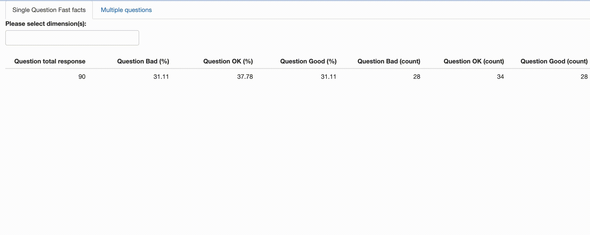

class: middle

# dataMojo R 包  

--
### 建立在 data.table 包的一个扩展包

--
### 提高了数据整合清理的效率

--
### 提高了运算速度

---
class: middle

# dataMojo R 包  


---
class: middle

# dataMojo R 包  


---

# shiny应用 


https://github.com/jienagu/demo_mojo_app




---

# 计算每行的百分比: `dataMojo`  

Github repo: https://github.com/jienagu/dataMojo


```{r slide1, eval=TRUE}
library(data.table)
test_df <- data.frame( Group = c("A", "B", "C"), 
                       Female = c(2,3,5),
                       Male = c(10,11, 13))
print(test_df)
```

```{r slide1-1, eval=TRUE}
library(dataMojo)
dataMojo::row_percent_convert(test_df, 
                              cols_rowsum = c("Female", "Male"))
```


---

# 计算基于某一列合计的百分比:  `dataMojo`  

实例：

```{r slide2-0, eval=TRUE}
test_dt <- data.table::data.table(
      Question = c(rep("Good", 3), rep("OK", 3), rep("Bad", 3)),
      Gender = c(rep("F", 4), rep("M", 5))
    )
print(test_dt)
```

Github repo: https://github.com/jienagu/dataMojo

---

# 计算基于某一列合计的百分比:  `dataMojo`  

实例 （续）：

```{r slide 2-0, echo=FALSE}
options(width = 70)
```

```{r slide2-1, eval=TRUE}
options(width = 80)
dataMojo::pivot_percent_at(test_dt, 
                          question_col = "Question", 
                          aggregated_by_cols = "Gender")
```

Github repo: https://github.com/jienagu/dataMojo


---

# 计算基于多列合计的百分比:  `dataMojo`  

实例：

```{r slide3-0, eval=TRUE}
test_dt <- data.table::data.table(
      Question1 = c(rep("Good", 3), rep("OK", 3), rep("Bad", 3)),
      Question2 = c(rep("Good", 2), rep("OK", 2), rep("Bad", 5)),
      Gender = c(rep("F", 4), rep("M", 5))
    )
print(test_dt)
```

Github repo: https://github.com/jienagu/dataMojo

---

# 计算基于多列合计的百分比:  `dataMojo`  

实例 （续）：

```{r slide 3-0, echo=FALSE, message=FALSE}
library(dplyr)
options(width = 70)
```

```{r slide3-1, eval=TRUE}
dataMojo::pivot_percent_at_multi(test_dt, 
          question_col = c("Question1","Question2"), 
          aggregated_by_cols = "Gender") 
```

---

# 基于条件的行延展:  `dataMojo`  

实例：

```{r slide4-0, eval=TRUE}
options(width =60)
data("starwars_simple")
starwars_simple[]
```

Github repo: https://github.com/jienagu/dataMojo

---

# 基于条件的行延展:  `dataMojo`  

实例 （续）：

```{r slide 4-1, echo=FALSE}
options(width = 70)
```

```{r slide4-2, eval=TRUE}
dataMojo::row_expand_pattern(starwars_simple, 
                             "films", 
                             ", ", 
                             "film")[]
```


---

# 基于起始和终止日期的行延展:  `dataMojo`  

实例：

```{r slide5-0, eval=TRUE}
dt_dates_simple <- data.table(
  Start_Date = as.Date(c("2020-02-03", "2020-03-01") ),
  End_Date = as.Date(c("2020-02-05", "2020-03-02") ),
  group = c("A", "B")
)
dt_dates_simple[]
```

Github repo: https://github.com/jienagu/dataMojo


---

# 基于起始和终止日期的行延展:  `dataMojo`  

实例 （续）：

```{r slide5-1, eval=TRUE}
row_expand_dates(dt_dates_simple, 
                 "Start_Date", 
                 "End_Date", 
                 "Date")[]
```

Github repo: https://github.com/jienagu/dataMojo

---

# 列选择:  `dataMojo`  

实例：

```{r slide6-0, eval=TRUE}
data("dt_dates")
dt_dates <- setDT(dt_dates)
print(dt_dates)
```

```{r slide6-1, eval=TRUE}
dataMojo::select_cols(dt_dates, c("Start_Date", "Full_name"))
```

---

# 分裂多列:  `dataMojo`  

实例：

```{r slide7-0, eval=TRUE}
print(dt_dates)
```

```{r slide7-1, eval=TRUE}
dataMojo::str_split_col(dt_dates, by_col = "Full_name",
              by_pattern = ", ",
              match_to_names = c("First Name", "Last Name"))
```


---

# 行筛选:  `dataMojo`  

实例：

筛选所有小于/等于/大于某一参数：

```{r slide8-0, eval=TRUE}
data("dt_values")
dataMojo::filter_all(dt_values, operator = "l", .2)
```


---

# 行筛选:  `dataMojo`  

实例：

筛选任一（小于/等于/大于）某一参数：

```{r slide9-0, eval=TRUE}
data("dt_values")
dataMojo::filter_any(dt_values, operator = "l", .1)
```


---

# 填补缺失:  `dataMojo`  

实例：


```{r slide10-0, eval=TRUE}
data("dt_missing")
dataMojo::fill_NA_with(dt_missing, 
                       fill_cols = c("Full_name"), 
                       fill_value = "pending")
```


---

# 分组汇总:  `dataMojo`  

实例：


```{r slide11-0, eval=TRUE}
data("dt_groups")
print(head(dt_groups))
```


---

# 分组汇总:  `dataMojo`  

实例 1（续）：

分组后，计算每组的`mean`, `medium`, `sum`, `min` 或 `max`

```{r slide11-1, eval=TRUE}
data("dt_groups")
dataMojo::dt_group_by(dt_groups, 
            group_by_cols = c("group1", "group2"), 
            summarize_at = "A1", 
            operation = "mean")
```


---

# 分组汇总:  `dataMojo`  

实例 1（续）：

分组后，列出每组的第一行 （`fetch_row = "first"`）或最后一行（`fetch_row = "last"`）

```{r slide11-2, eval=TRUE}
data("dt_groups")
dataMojo::get_row_group_by(dt_groups, 
                 group_by_cols = c("group1", "group2"), 
                 fetch_row = "first")
```


---

# 和`dplyr`速度比对:  `dataMojo`  

```{r slide12-1-0, echo=FALSE,   message=FALSE}
set.seed(42)
library(dplyr)
test_dt <- data.table(
  A1 = runif(100000),
  B  = rep(1:1000,100),
  C  = rep(1:10,10000)
)

test_df <- data.frame(test_dt)
library(dplyr)
dataMojo_test <- function(){
  dataMojo::dt_group_by(test_dt, 
                       group_by_cols = c("B", "C"), 
                       summarize_at = "A1", 
                       operation = "mean")
}

dplyr_test <- function(){
  test_df %>% 
    dplyr::group_by(B, C) %>% 
    dplyr::summarise(A1= mean(A1))
}

```

```{r slide12-1, eval=TRUE, message=FALSE}

library(microbenchmark)
library(ggplot2)
res_group <- microbenchmark(dataMojo_test(), dplyr_test(), times=100)
print(res_group)
```


---

# 和`dplyr`速度比对:  `dataMojo`  


```{r slide12-2, eval=TRUE, message=FALSE}
ggplot2::autoplot(res_group)
```


---

# 数据结构调整:宽变长 

实例：

```{r slide13-1, eval=TRUE}
data("dt_dates")
print(head(dt_dates))
```

---

# 数据结构调整:宽变长 

实例 （续）：

```{r slide13-2, eval=TRUE}
dataMojo::reshape_longer(dt_dates, 
               keep_cols = "Full_name", 
               by_pattern = "Date", 
               label_cols = c("Date_Type"), 
               value_cols = "Exact_date", 
               fill_NA_with = NULL)
```


---

# 数据结构调整:长变宽 

实例：

```{r slide14-1, eval=TRUE}
data("dt_long")
print(head(dt_long))
```


---

# 数据结构调整:长变宽 

实例 （续）：

```{r slide14-2, eval=TRUE}
dataMojo::reshape_wider(dt_long, 
              keep_cols = c("Full_name"), 
              col_lable = c("Date_Type"), 
              col_value = "Exact_date")
```


---

# shiny应用 


https://github.com/jienagu/demo_mojo_app


---
class: middle

# 为开源社区贡献


---
class: middle

# 谢谢
